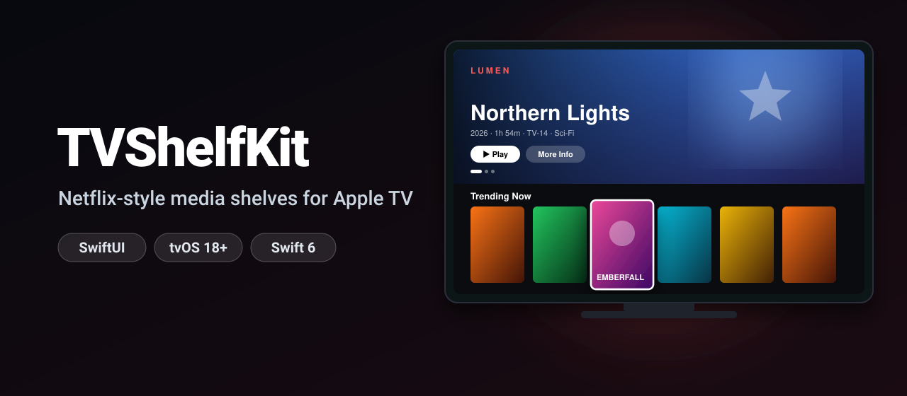
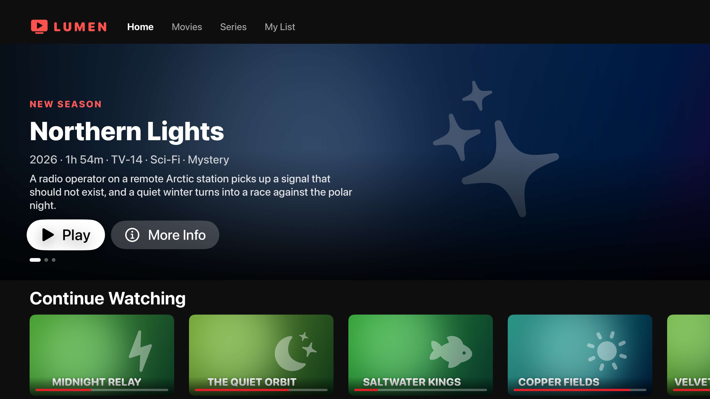
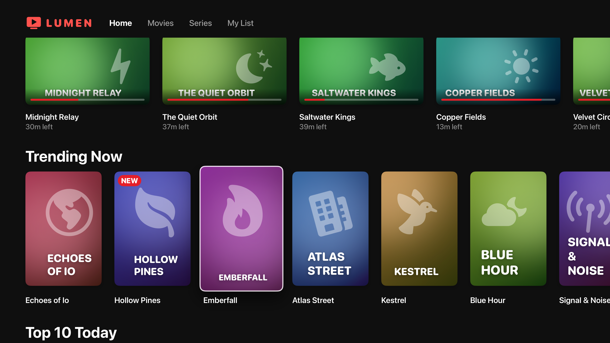
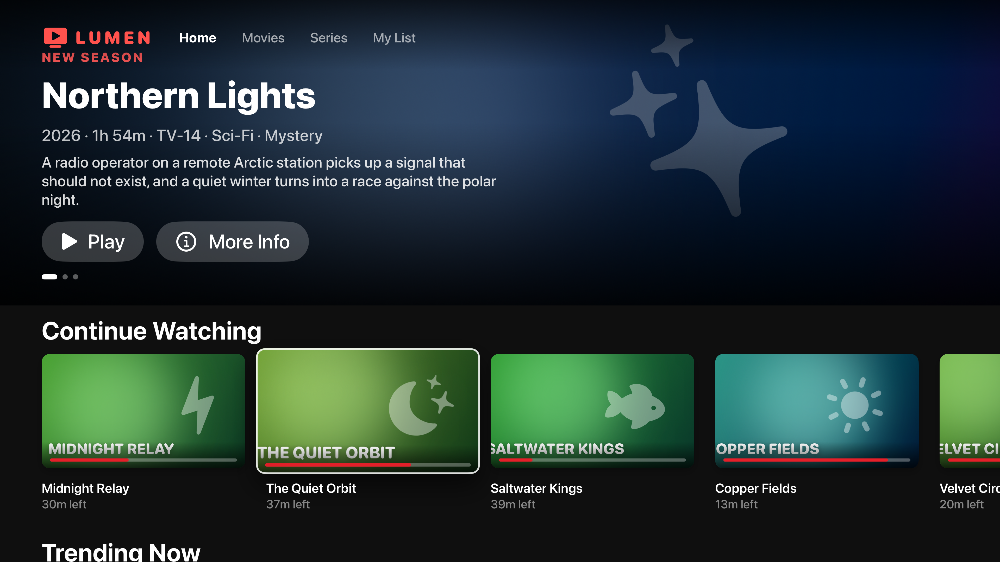
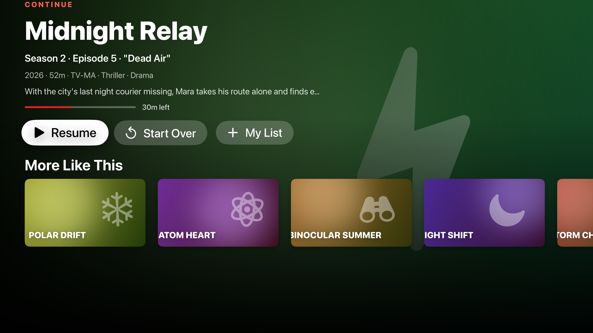

<p align="center">
  
</p>

<p align="center">
  <a href="https://github.com/halilozel1903/TVShelfKit/actions/workflows/ci.yml"></a>
  
  
  
  
  <a href="LICENSE"></a>
</p>

**TVShelfKit** builds the home screen of a streaming app for Apple TV in SwiftUI: an auto-advancing **hero banner**, horizontal **shelves** of posters that grow, lift and shift with **parallax** when focused, **Continue Watching** cards with progress bars, **Top 10** rows and section headers. Focus is remembered per shelf, the hero pauses while you browse, and a **Top Shelf** builder turns the same data into the content of your Top Shelf extension. The logic is plain Swift with no UI types, so it is fully unit tested.

```swift
ShelfBrowser(hero: featured, shelves: shelves) { item in
    selection = item
}
```

## Screenshots

Captured from the example app on an Apple TV 4K simulator by CI. All titles and artwork are made up and generated in SwiftUI.

| Home | Focused poster |
| :---: | :---: |
|  |  |
| **Continue Watching** | **Detail** |
|  |  |

## Features

- **`ShelfBrowser`**: a complete home screen, hero banner on top and shelves below, in one view.
- **Hero banner**: full-bleed artwork, badge, title, metadata, summary, Play / Resume and More Info buttons and page dots. Advances on its own, restarts its countdown when focus moves, pauses while you browse shelves or read a detail screen, and respects Reduce Motion.
- **Focus-driven rows**: the focused card scales up, lifts on a shadow and gets a highlight; nothing is clipped. Each row is a focus section, and focus returns to the card you left when you come back to a row.
- **Parallax posters**: the artwork inside each card slides as the card moves across the screen, as if it sat behind the frame.
- **Four layouts**: `.poster` (2:3), `.landscape` (16:9), `.continueWatching` (16:9 with a progress bar and "32m left") and `.ranked` (Top 10 with large numbers).
- **Building blocks**: `ShelfRow`, `ShelfCard`, `HeroBanner`, `ShelfSectionHeader`, `ShelfProgressBar`, `ShelfCardButtonStyle` and `HeroButtonStyle` work on their own.
- **Top Shelf helpers**: `TopShelfBuilder` turns shelves into sectioned or carousel Top Shelf content with play and display deep links; one call converts it to `TVTopShelfContent`.
- **Deep links**: `ShelfDeepLink` builds and parses `myapp://play?id=…` URLs safely.
- **Generated artwork**: `ShelfPlaceholderArtwork` draws a deterministic gradient, glow, SF Symbol and title for any item: perfect for placeholders, previews and demos.
- **Tested logic**: carousel and paging math, parallax math, progress formatting, the focus state machine, the Top Shelf builder and deep links, with Swift Testing.
- **Swift 6 strict concurrency**, zero dependencies. Built for tvOS 18; also compiles on iOS 18 and macOS 15 with smaller default sizes.

## Installation

### Swift Package Manager

In Xcode choose **File › Add Package Dependencies…** and enter:

```
https://github.com/halilozel1903/TVShelfKit
```

Or add it to `Package.swift`:

```swift
dependencies: [
    .package(url: "https://github.com/halilozel1903/TVShelfKit", from: "1.0.0")
]
```

## Quick start

```swift
import SwiftUI
import TVShelfKit

struct HomeScreen: View {
    let featured: [ShelfItem]
    let library: [ShelfItem]
    let trending: [ShelfItem]
    @State private var selection: ShelfItem?

    var body: some View {
        ShelfBrowser(
            hero: featured,
            shelves: [
                .continueWatching(from: library),
                Shelf(id: "trending", title: "Trending Now", layout: .poster, items: trending),
                Shelf(id: "top", title: "Top 10 Today", layout: .ranked, items: Array(trending.prefix(10))),
            ]
        ) { item in
            selection = item
        }
        .ignoresSafeArea()
        .fullScreenCover(item: $selection) { item in
            PlayerScreen(item: item)
        }
    }
}
```

Without an `artwork` closure, every card uses generated placeholder artwork, so you can build the whole screen before your images exist.

## Usage

### Items and shelves

```swift
let episode = ShelfItem(
    id: "midnight-relay-s2e5",
    title: "Midnight Relay",
    subtitle: "S2 · E5",
    summary: "The city's last night courier is missing.",
    genres: ["Thriller", "Drama"],
    year: 2026,
    runtime: 3_120,               // seconds
    contentRating: "TV-MA",
    badge: "New",
    symbolName: "bolt.fill",      // used by the placeholder artwork
    progress: 0.42                // 0...1, clamped
)

episode.metadataLine    // "2026 · 52m · TV-MA · Thriller · Drama"
episode.remainingText   // "30m left"
episode.isInProgress    // true

let shelf = Shelf(id: "new", title: "New Episodes", subtitle: "Every Friday", layout: .landscape, items: episodes)
let resume = Shelf.continueWatching(from: library)   // started, not finished, in order
```

### Your own artwork

The artwork closure gets the item and where it is shown, so you can pick a backdrop for the hero and a poster or a still for cards. Any view works, such as `AsyncImage` or your image cache:

```swift
ShelfBrowser(hero: featured, shelves: shelves, artwork: { item, slot in
    switch slot {
    case .hero:
        CachedImage(url: item.backdropURL)
    case .card(let layout):
        CachedImage(url: layout.isPortrait ? item.posterURL : item.stillURL)
    }
}) { item in
    selection = item
}
```

The artwork is sized, clipped to the card's rounded rectangle and given parallax for you.

### Focus

```swift
ShelfBrowser(
    hero: featured,
    shelves: shelves,
    initialFocus: ShelfFocusID(shelfID: "trending", itemID: "emberfall"),   // start on a card
    onFocusChange: { item in backdrop = item }                               // e.g. a dynamic background
) { item in
    selection = item
}
```

`ShelfBrowser` keeps a `ShelfFocusTracker`, a small state machine you can also use on its own:

```swift
var tracker = ShelfFocusTracker()
tracker.handle(.focusItem(ShelfFocusID(shelfID: "trending", itemID: "3")))
tracker.handle(.select(ShelfFocusID(shelfID: "trending", itemID: "3")))
tracker.phase                          // .presenting
tracker.allowsHeroAutoAdvance          // false: the hero waits while a detail screen is open
tracker.handle(.dismiss)
tracker.remembered(in: "trending")     // "3": where focus returns in that row
```

### Hero banner

```swift
HeroBanner(
    items: featured,
    interval: .seconds(10),
    pausesWhileFocused: true,
    onPlay: { item in play(item) },
    onInfo: { item in selection = item }
) { item in
    CachedImage(url: item.backdropURL)
}
```

The Play button reads **Resume** for items in progress. Pass `autoAdvances: false` to keep it on one item.

### Rows and cards on their own

```swift
ScrollView {
    VStack(alignment: .leading) {
        ShelfRow(shelf: trending) { item in selection = item }
        ShelfRow(shelf: topTen) { item in selection = item }
    }
}

ShelfCard(item: item, layout: .continueWatching) { resume(item) }

Button("Play") { play() }
    .buttonStyle(HeroButtonStyle())
```

### Sizes

tvOS uses sizes designed for a 1920 × 1080 point screen; iOS and macOS use smaller ones. Change them for a whole screen:

```swift
ShelfBrowser(hero: featured, shelves: shelves) { item in selection = item }
    .shelfMetrics(ShelfMetrics(posterHeight: 420, focusedScale: 1.12, parallaxAmount: 32))
```

### Top Shelf

Build the content from the same shelves your app shows, in your Top Shelf extension:

```swift
import TVServices
import TVShelfKit

final class ContentProvider: TVTopShelfContentProvider {
    override func loadTopShelfContent() async -> (any TVTopShelfContent)? {
        let shelves = await Catalog.shared.homeShelves()
        let builder = TopShelfBuilder(urlScheme: "lumen") { item, shape in
            URL(string: "https://img.example.com/\(item.id)/\(shape.rawValue).jpg")
        }
        return builder.sectioned(shelves).makeTVTopShelfContent()
        // or: builder.carousel(featured, style: .details).makeTVTopShelfContent()
    }
}
```

Empty shelves, finished items in Continue Watching and duplicates are dropped, counts are limited, in-progress items carry their progress, and every item gets two deep links. Handle them in the app:

```swift
.onOpenURL { url in
    guard let link = ShelfDeepLink(url: url, scheme: "lumen") else { return }
    switch link.action {
    case .display: selection = catalog.item(id: link.itemID)
    case .play: play(catalog.item(id: link.itemID))
    }
}
```

`TopShelfContent` is a plain value, so you can unit test your Top Shelf without TVServices.

### Pure logic

```swift
CarouselMath.next(after: 4, count: 5)                        // 0
CarouselMath.shortestDistance(from: 0, to: 4, count: 5)      // -1
CarouselMath.visibleCount(containerWidth: 1920, itemWidth: 240, spacing: 40)   // 7
ParallaxMath.offset(midX: 1440, containerWidth: 1920, maxOffset: 24)           // -12
PlaybackProgress.durationText(6_720)                         // "1h 52m"
PlaybackProgress.remainingText(runtime: 7_200, progress: 0.4) // "1h 12m left"
```

## How it works

Every card is a `Button` with a custom `ButtonStyle`. On tvOS a custom style turns off the system focus effect, so the style reads `isFocused` from the environment and draws its own: a spring scale, a deeper shadow and a thin outline, with animation dropped under Reduce Motion. Rows are horizontal scroll views with clipping disabled and room above and below for the focused card, marked as focus sections so moving up or down lands on the nearest card. The browser binds every card to one `@FocusState` value (`ShelfFocusID`: shelf and item), feeds focus changes into `ShelfFocusTracker` and gives each row a `defaultFocus` with user-initiated priority for the card it remembers. Parallax reads each card's position on screen and slides its oversized artwork against it. The hero banner advances with a `.task(id:)` that sleeps for the interval and restarts whenever the index, focus or pause state changes.

## Example app

The `Example` folder contains an Apple TV app for a made-up streaming service, "Lumen": a hero banner, Continue Watching, Trending Now, Top 10, New Episodes and a recommendation row, all with generated artwork, and a detail screen. It uses [XcodeGen](https://github.com/yonaskolb/XcodeGen) so no project file has to live in the repo:

```bash
brew install xcodegen
cd Example && xcodegen generate
open TVShelfDemo.xcodeproj
```

Launch it with `-screenshot home`, `focused`, `continue` or `detail` to open the scenes used for the screenshots above.

## Requirements

- Xcode 26 or later (Swift 6.2 toolchain)
- tvOS 18+ (iOS 18+ and macOS 15+ are supported too)

## Contributing

Issues and pull requests are welcome. Please run `swift test` before opening a PR.

## License

TVShelfKit is available under the MIT license. See [LICENSE](LICENSE).
